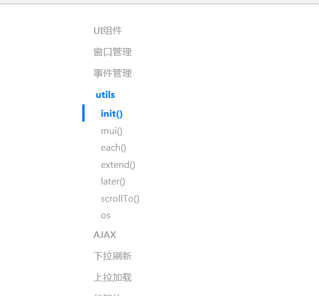

# Hbuilder 学习记录


```js

 // 主界面按钮修改
    qiao.h.indexPage().evalJS("hideBackBtn();");

```


## jQuery Mobile tap 事件

### 定义和用法

> tap 事件在用户轻击一个元素时触发。
提示： tap 事件类似于 jQuery click() 方法。


# MUI

## MUI之 原生UI组件


## MUI之 窗口管理

### 页面初始化
在app开发中，若要使用HTML5+扩展api，必须等plusready事件发生后才能正常使用，mui将该事件封装成了mui.plusReady()方法，涉及到HTML5+的api，建议都写在mui.plusReady方法中。如下为打印当前页面URL的示例：


### 创建子页面

在mobile app开发过程中，经常遇到卡头卡尾的页面，此时若使用局部滚动，在android手机上会出现滚动不流畅的问题； mui的解决思路是：将需要滚动的区域通过单独的webview实现，完全使用原生滚动。具体做法则是：将目标页面分解为主页面和内容页面，主页面显示卡头卡尾区域，比如顶部导航、底部选项卡等；内容页面显示具体需要滚动的内容，然后在主页面中调用mui.init方法初始化内容页面。

### 打开新页面

做web app，一个无法避开的问题就是转场动画；web是基于链接构建的，从一个页面点击链接跳转到另一个页面，如果通过有刷新的打开方式，用户要面对一个空白的页面等待；如果通过无刷新的方式，用Javascript移入DOM节点（常见的SPA解决方案），会碰到很高的性能挑战：DOM节点繁多，页面太大，转场动画不流畅甚至导致浏览器崩溃； mui的解决思路是：单webview只承载单个页面的dom，减少dom层级及页面大小；页面切换使用原生动画，将最耗性能的部分交给原生实现.

### 关闭页面

在mui框架中，有三种操作会触发页面关闭（执行mui.back方法）：

			点击包含.mui-action-back类的控件
			在屏幕内，向右快速滑动
			Android手机按下back按键

### 预加载

所谓的预加载技术就是在用户尚未触发页面跳转时，提前创建目标页面，这样当用户跳转时，就可以立即进行页面切换，节省创建新页面的时间，提升app使用体验。mui提供两种方式实现页面预加载。

* **方式一：通过mui.init方法中的preloadPages参数进行配置.**
```js
mui.init({
  preloadPages:[
    {
      url:'list.html',
      id:'list'
    }
  ]
});
var list = plus.webview.getWebviewByid('list');//这里可能返回空；

```
* **方式二：通过mui.preload方法预加载.**
```js
var page = mui.preload({
    url:new-page-url,
    id:new-page-id,//默认使用当前页面的url作为id
    styles:{},//窗口参数
    extras:{}//自定义扩展参数
});
```

## MUI之 事件操作

http://dev.dcloud.net.cn/mui/event/

* 自定义事件

```js
window.addEventListener('customEvent',function(event){
  //通过event.detail可获得传递过来的参数内容
  ....
});
```

## utils

### init()
> mui框架将很多功能配置都集中在mui.init方法中，要使用某项功能，只需要在mui.init方法中完成对应参数配置即可，目前支持在mui.init方法中配置的功能包括：创建子页面、关闭页面、手势事件配置、预加载、下拉刷新、上拉加载、设置系统状态栏背景颜色。

### mui()
> mui使用css选择器获取HTML元素，返回mui对象数组

### each()

> each既是一个类方法，同时也是一个对象方法，两个方法适用场景不同；换言之，你可以使用mui.each()去遍历数组或json对象，也可以使用mui(selector).each()去遍历DOM结构。

### extend()
> 将两个对象合并成一个对象。

### later()
> setTimeOut封装

### scrollTo()
> 滚动窗口屏幕到指定位置，该方法是对window.scrollTo()方法在手机端的增强实现，可设定滚动动画时间及滚动结束后的回调函数;鉴于手机屏幕大小，该方法仅可实现屏幕纵向滚动。


## MUI 之AJAX

http://dev.dcloud.net.cn/mui/ajax/

> mui框架基于htm5plus的XMLHttpRequest，封装了常用的Ajax函数，支持GET、POST请求方式，支持返回json、xml、html、text、script数据类型； 本着极简的设计原则，mui提供了mui.ajax方法，并在mui.ajax方法基础上，进一步简化出最常用的mui.get()、mui.getJSON()、mui.post()三个方法。


# 页面跳转

从A页面打开B页面，B页面为一个需要从服务端加载的列表页面，若在B页面loaded事件发生时就将其显示出来，因服务器数据尚未加载完毕，列表页面为空，用户体验不好；可通过如下方式改善用户体验（最好的用户体验应该是通过预加载的方式）：第一步，B页面loaded事件发生后，不自动显示；

```js
//A页面中打开B页面，设置show的autoShow为false，则B页面在其loaded事件发生后，不会自动显示；
mui.openWindow({
    url: 'B.html', 
    show:{
      autoShow:false
    }
  });
```

第二步，在B页面获取列表数据后，再关闭等待框、显示B页面


```js
//B页面onload从服务器获取列表数据；
window.onload = function(){
  //从服务器获取数据
  ....
  //业务数据获取完毕，并已插入当前页面DOM；
  //注意：若为ajax请求，则需将如下代码放在处理完ajax响应数据之后；
  mui.plusReady(function(){
    //关闭等待框
    plus.nativeUI.closeWaiting();
    //显示当前页面
    mui.currentWebview.show();
  });
}
```


# [常见mui方法使用说明](http://dev.dcloud.net.cn/mui/util/#init)




## mui.init() mui插件初始化

mui框架将很多功能配置都集中在mui.init方法中，要使用某项功能，只需要在mui.init方法中完成对应参数配置即可，目前支持在mui.init方法中配置的功能包括：创建子页面、关闭页面、手势事件配置、预加载、下拉刷新、上拉加载、设置系统状态栏背景颜色。

mui需要在页面加载时初始化很多基础控件,如监听返回键,因此务必在每个页面中调用


## mui.ready()  当DOM准备就绪时，指定一个函数来执行。

## mui.plusReady() HTML5+的api

## mui()

mui使用css选择器获取HTML元素，返回mui对象数组

```js
mui("p")：选取所有<p>元素
mui("p.title")：选取所有包含.title类的<p>元素

```
若要将mui对象转化成dom对象，可使用如下方法（类似jquery对象转成dom对象）

```
//obj1是mui对象
var obj1 = mui("#title");
//obj2是dom对象
var obj2 = obj1[0]; 
```

## each()

each既是一个类方法，同时也是一个对象方法，两个方法适用场景不同；换言之，你可以使用mui.each()去遍历数组或json对象，也可以使用mui(selector).each()去遍历DOM结构。

```js
var array = [1,2,3]
mui.each(array,function(index,item){
  console.log(item*item);
}) 
```
## extend()

将两个对象合并成一个对象。


## later()

setTimeOut封装

## os

我们经常会有通过navigator.userAgent判断当前运行环境的需求,mui对此进行了封装,通过调用mui.os.XXX即可

### mui.os.plus
返回是否在 5+ App(包括流应用)运行

### mui.os.android
返回是否为安卓手机

### mui.os.iphone
返回是否为苹果手机


## 示例---下拉刷新最佳实践(shipin---webview.html)

```js
<!DOCTYPE HTML>
<html>

	<head>
		<meta charset="utf-8" />
		<meta name="viewport" content="initial-scale=1.0, maximum-scale=1.0, user-scalable=no" />
		<meta name="HandheldFriendly" content="true" />
		<meta name="MobileOptimized" content="320" />
		<title>Webview Example</title>
		<script type="text/javascript" charset="utf-8">
			var ws = null;
			var list = null;
			// 扩展API加载完毕，现在可以正常调用扩展API 
			function plusReady() {
				ws = plus.webview.currentWebview();
				ws.setPullToRefresh({
					support: true,
					style: 'circle',
					offset: '45px'
				}, onRefresh);
				// 第一次打开页面即开始刷新列表
				setTimeout(function() {
					console.log('Initializ refresh');
					ws.beginPullToRefresh();
				}, 200);
			}
			// 判断扩展API是否准备，否则监听'plusready'事件
			if(window.plus) {
				plusReady();
			} else {
				document.addEventListener('plusready', plusReady, false);
			}
			// DOM构建完成获取列表元素
			document.addEventListener('DOMContentLoaded', function() {
				list = document.getElementById('list');
			})
			// 刷新页面
			function onRefresh() {
				setTimeout(function() {
					if(list) {
						var item = document.createElement('li');
						item.innerHTML = '<span>New Item ' + (new Date()) + '</span>';
						list.insertBefore(item, list.firstChild);
					}
					ws.endPullToRefresh();
				}, 1000);
			}
		</script>
		<style type="text/css">
			li {
				padding: 1em;
				border-bottom: 1px solid #eaeaea;
			}
			
			li:active {
				background: #f4f4f4;
			}
		</style>
	</head>

	<body>
		<ul id="list" style="list-style:none;margin:0;padding:0;">
			<li><span>Initializ List Item 1</span></li>
			<li><span>Initializ List Item 2</span></li>
			<li><span>Initializ List Item 3</span></li>
			<li><span>Initializ List Item 4</span></li>
			<li><span>Initializ List Item 5</span></li>
			<li><span>Initializ List Item 6</span></li>
			<li><span>Initializ List Item 7</span></li>
			<li><span>Initializ List Item 8</span></li>
			<li><span>Initializ List Item 9</span></li>
			<li><span>Initializ List Item 10</span></li>
		</ul>
	</body>

</html>
```


# 示例----判断网络状况

```
//判断网络状况
					if(plus.networkinfo.getCurrentType()==plus.networkinfo.CONNECTION_NONE){
								mui.toast("当前网络不给力，请稍后再试哦");
						}
```


