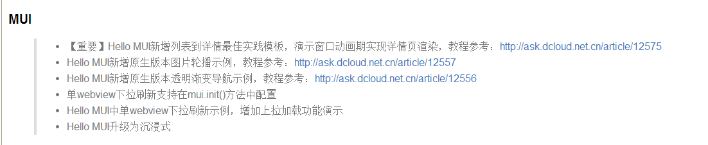
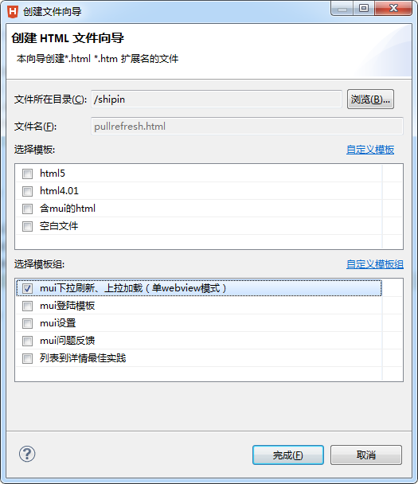

# Hubilder的那些坑


## 第一坑:下拉/上拉 刷新

今天更新了huilder版本,捡到等新内容里面新增新建html,单webview下拉刷新示例




因为我之前的项目中也用到了 上拉/下拉刷新,出了一个bug,就是在android上一点问题都没有,但在ios上却始终不显示数据,

所以就想着试试这个版本,

于是我就用hbuilder新建了一个下拉刷新的模版,如下;




```js
<!DOCTYPE html>
<html>

	<head>
		<meta charset="utf-8">
		<title>Hello MUI</title>
		<meta name="viewport" content="width=device-width, initial-scale=1,maximum-scale=1,user-scalable=no">
		<meta name="apple-mobile-web-app-capable" content="yes">
		<meta name="apple-mobile-web-app-status-bar-style" content="black">

		<link rel="stylesheet" href="css/mui.min.css">
		<style type="text/css">
			.mui-content>.mui-table-view:first-child {
				margin-top: -1px;
			}
		</style>
	</head>

	<body>
		<header class="mui-bar mui-bar-nav">
			<h1 id="title" class="mui-title">下拉刷新和上来加载 单webview模式</h1>
		</header>
		<!--下拉刷新容器-->
		<div id="pullrefresh" class="mui-content">
			<!--数据列表-->
			<ul class="mui-table-view mui-table-view-chevron"></ul>
		</div>
		<script src="js/mui.min.js" type="text/javascript" charset="utf-8"></script>
		<script>
			mui.init({
				pullRefresh: {
					container: '#pullrefresh',
					down: {
						style:'circle',
						callback: pulldownRefresh
					},
					up: {
						auto:true,
						contentrefresh: '正在加载...',
						callback: pullupRefresh
					}
				}
			});
			
			var count = 0;
			function pullupRefresh() {
				setTimeout(function() {
					mui('#pullrefresh').pullRefresh().endPullup((++count > 2)); //参数为true代表没有更多数据了。
					var table = document.body.querySelector('.mui-table-view');
					var cells = document.body.querySelectorAll('.mui-table-view-cell');
					var newCount = cells.length>0?5:20;//首次加载20条，满屏
					for (var i = cells.length, len = i + newCount; i < len; i++) {
						var li = document.createElement('li');
						li.className = 'mui-table-view-cell';
						li.innerHTML = '<a class="mui-navigate-right">Item ' + (i + 1) + '</a>';
						table.appendChild(li);
					}
				}, 1500);
			}

			function addData() {
				var table = document.body.querySelector('.mui-table-view');
				var cells = document.body.querySelectorAll('.mui-table-view-cell');
				for(var i = cells.length, len = i + 5; i < len; i++) {
					var li = document.createElement('li');
					li.className = 'mui-table-view-cell';
					li.innerHTML = '<a class="mui-navigate-right">Item ' + (i + 1) + '</a>';
					//下拉刷新，新纪录插到最前面；
					table.insertBefore(li, table.firstChild);
				}
			}
			/**
			 * 下拉刷新具体业务实现
			 */
			function pulldownRefresh() {
				setTimeout(function() {
					addData();
					mui('#pullrefresh').pullRefresh().endPulldown();
					mui.toast("为你推荐了5篇文章");
				}, 1500);
			}

		</script>
	</body>

</html>
```

运行测试,完美,毫无问题!

但是当我把这个页面原封不懂拷到我之前的项目时,死活报错:

```js
mui('#pullrefresh').pullRefresh().endPullup((++count > 2)); //参数为true代表没有更多数据了。
```

就是这句代码,搞得我很崩溃,

后来终于发现:**原来是 新建的html会自动生成js css两个文件,里面包含了mui.js和,mui.css.**

而我的之前的项目由于是更新之前的时候新建项目产生的 js和css两个文件,所以说:


**升级前后两个版本的 js ,css文件页升级了,只是我没更新我项目的 js和css文件,所以才出现这种bug,**

想想之前,ios版本的下拉刷新出现的bug也不难理解了.


**解决办法: 把新版本产生的js,css文件覆盖掉旧版本的即可.**


.......过分!!!


## 第二坑:onclick事件的bug

在li标签中使用onclick事件在ios中无反应

改用 on 事件添加:

```js
mui("#pullrefresh").on('tap', 'li', function() {
				
				var value = h(this).find("a").val();

				var begindate = "" + value + "01";
				var enddate = "" + value + "31";

				mui.openWindow({
					url: '../sales-search-list.html',
					extras: {
						"startdate": begindate,
						"enddate": enddate,
					},
				});
				

			});

```


