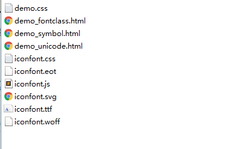
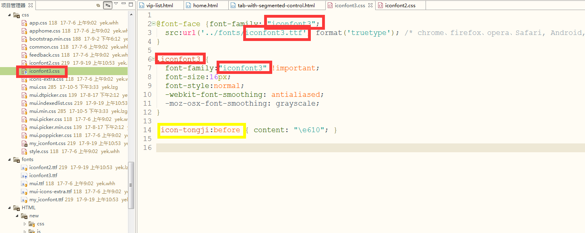
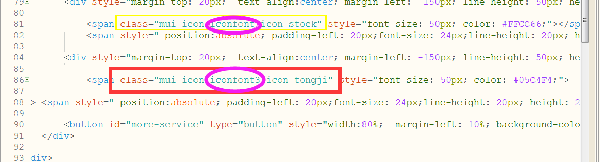

# mui结合阿里巴巴适量图标库的使用

阿里巴巴矢量图标库官网:http://iconfont.cn/collections/index

使用:

## 第一步:下载项目

## 第二步:打开压缩包,

## 第三步:复制 iconfont.css 和 iconfont.ttf 文件到项目中即可

## 第四步:改名字

**有以下几处要修改:**

## 第五部:开始使用

引用css样式

引用图标:

