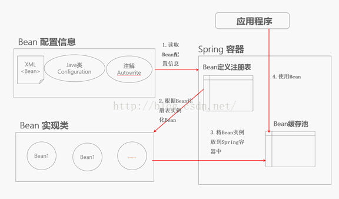

#  Spring 的配置文件概述
http://blog.csdn.net/icarus_wang/article/details/51559850




# Spring配置多数据源

http://www.cnblogs.com/lzrabbit/p/3750803.html


# 全面分析 Spring 的编程式事务管理及声明式事务管理

* 1,为什么要使用事物 ?

* 2,为什么要让spring管理事物 ?

* 3,编程式事物和声明式事物 ?

https://www.ibm.com/developerworks/cn/education/opensource/os-cn-spring-trans/index.html

> 如果方法需要实施事务管理，我们首先需要在方法开始执行前启动一个事务，调用PlatformTransactionManager.getTransaction(...) 方法便可启动一个事务。创建并启动了事务之后，便可以开始编写业务逻辑代码，然后在适当的地方执行事务的提交或者回滚。


**Spring 的声明式事务管理概述:
Spring 的声明式事务管理在底层是建立在 AOP 的基础之上的。其本质是对方法前后进行拦截，然后在目标方法开始之前创建或者加入一个事务，在执行完目标方法之后根据执行情况提交或者回滚事务。**


通常情况下，笔者强烈建议在开发中使用声明式事务，不仅因为其简单，更主要是因为这样使得纯业务代码不被污染，极大方便后期的代码维护。

和编程式事务相比，声明式事务唯一不足地方是，后者的最细粒度只能作用到方法级别，无法做到像编程式事务那样可以作用到代码块级别。但是即便有这样的需求，也存在很多变通的方法，比如，可以将需要进行事务管理的代码块独立为方法等等。


## 基于 @Transactional 的声明式事务管理

除了基于命名空间的事务配置方式，Spring 2.x 还引入了基于 Annotation 的方式，具体主要涉及@Transactional 标注。@Transactional 可以作用于接口、接口方法、类以及类方法上。当作用于类上时，该类的所有 public 方法将都具有该类型的事务属性，同时，我们也可以在方法级别使用该标注来覆盖类级别的定义。

```java
/**
 * Copyright &copy; 2015-2020 <a href="http://www.jeeplus.org/">JeePlus</a> All rights reserved.
 */
package com.jeeplus.modules.year.service.vip;

import java.util.List;

import org.springframework.stereotype.Service;
import org.springframework.transaction.annotation.Transactional;

import com.jeeplus.common.persistence.Page;
import com.jeeplus.common.service.CrudService;
import com.jeeplus.modules.year.entity.vip.EVipserver;
import com.jeeplus.modules.year.dao.vip.EVipserverDao;

/**
 * 会员绿色售后通道Service
 * @author itguang
 * @version 2017-08-31
 */
@Service
@Transactional(readOnly = true)
public class EVipserverService extends CrudService<EVipserverDao, EVipserver> {

	public EVipserver get(String id) {
		return super.get(id);
	}
	
	public List<EVipserver> findList(EVipserver eVipserver) {
		return super.findList(eVipserver);
	}
	
	public Page<EVipserver> findPage(Page<EVipserver> page, EVipserver eVipserver) {
		return super.findPage(page, eVipserver);
	}
	
	@Transactional(readOnly = false)
	public void save(EVipserver eVipserver) {
		super.save(eVipserver);
	}
	
	@Transactional(readOnly = false)
	public void delete(EVipserver eVipserver) {
		super.delete(eVipserver);
	}
	
	
	
	
}
```

Spring 使用 BeanPostProcessor 来处理 Bean 中的标注，因此我们需要在配置文件中作如下声明来激活该后处理 Bean，如清单13所示：
清单13. 启用后处理Bean的配置


```xml
<tx:annotation-driven transaction-manager="transactionManager"/>
```


虽然 @Transactional 注解可以作用于接口、接口方法、类以及类方法上，但是 Spring 小组建议不要在接口或者接口方法上使用该注解，因为这只有在使用基于接口的代理时它才会生效。另外， @Transactional 注解应该只被应用到 public 方法上，这是由 Spring AOP 的本质决定的。如果你在 protected、private 或者默认可见性的方法上使用 @Transactional 注解，这将被忽略，也不会抛出任何异常。


基于 <tx> 命名空间和基于 @Transactional 的事务声明方式各有优缺点。基于 <tx> 的方式，其优点是与切点表达式结合，功能强大。利用切点表达式，一个配置可以匹配多个方法，而基于 @Transactional 的方式必须在每一个需要使用事务的方法或者类上用 @Transactional 标注，尽管可能大多数事务的规则是一致的，但是对 @Transactional 而言，也无法重用，必须逐个指定。另一方面，基于 @Transactional 的方式使用起来非常简单明了，没有学习成本。开发人员可以根据需要，任选其中一种使用，甚至也可以根据需要混合使用这两种方式。


