# idea 版本控制

***

## idea多model版本控制

如下图:

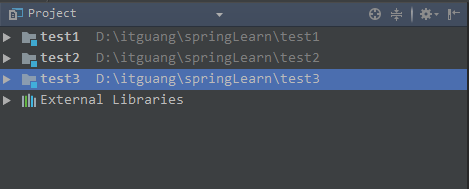

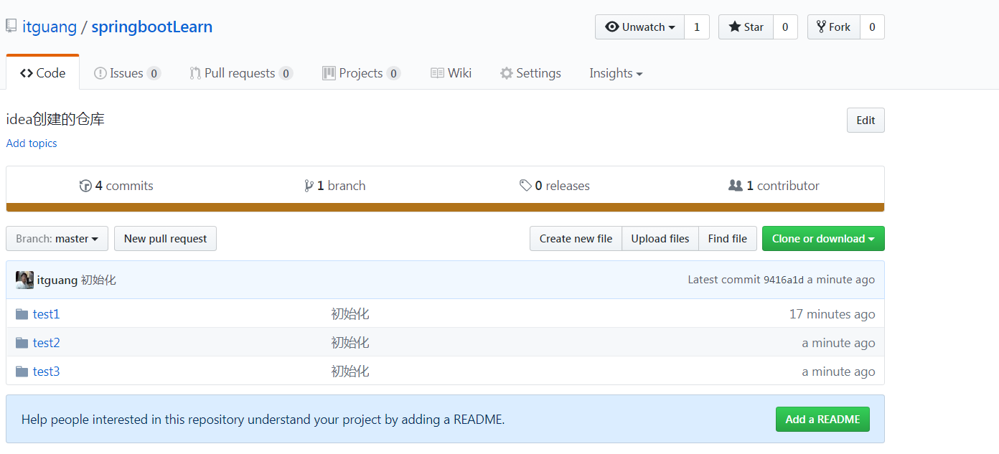

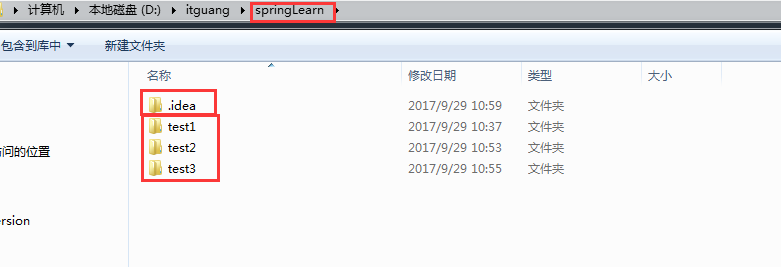

把一个项目下的多个model都提交到一个git仓库,怎么办呢?

> 准备工作:
**首先你要安装git并且在idea中配置好你的github账号密码,可参考此篇文章:http://blog.csdn.net/fatlitalk/article/details/53824844**

* 第一步:idea 创建一个空project
  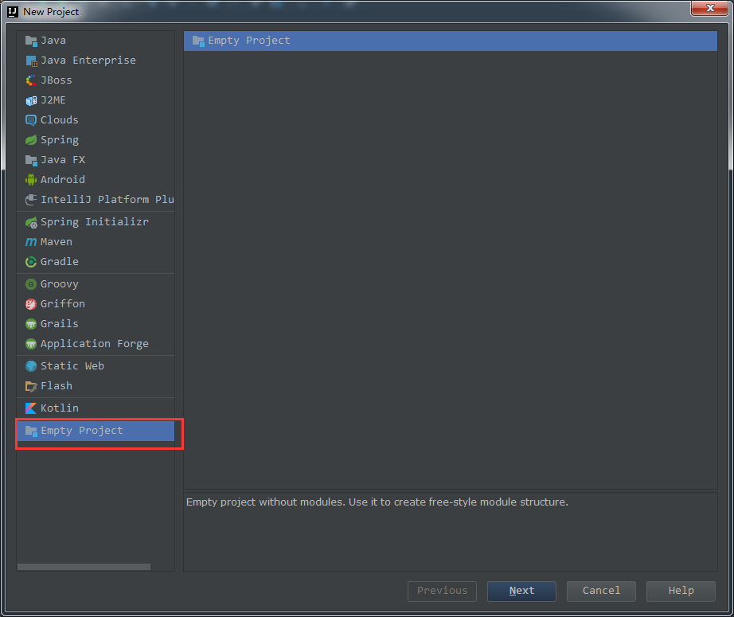

选择路径:

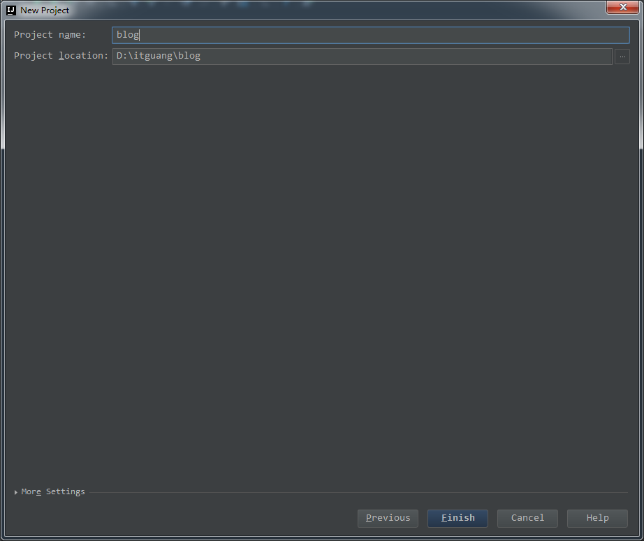

创建好后如图所示:

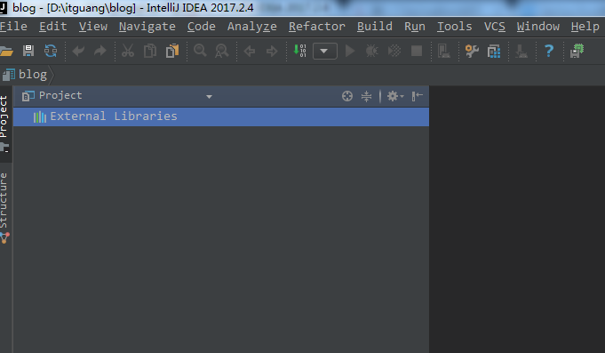

* 第二步:
VCS—>Import into Version Control—>Share Project on GitHub
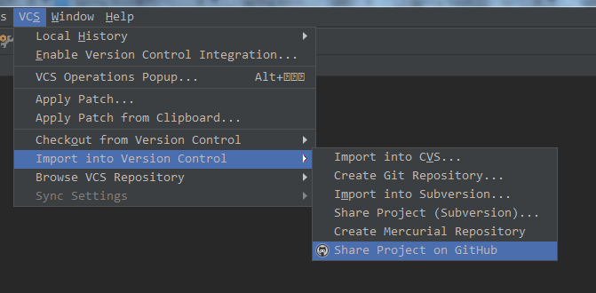

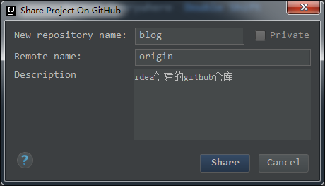
创建好后,如下图所示:
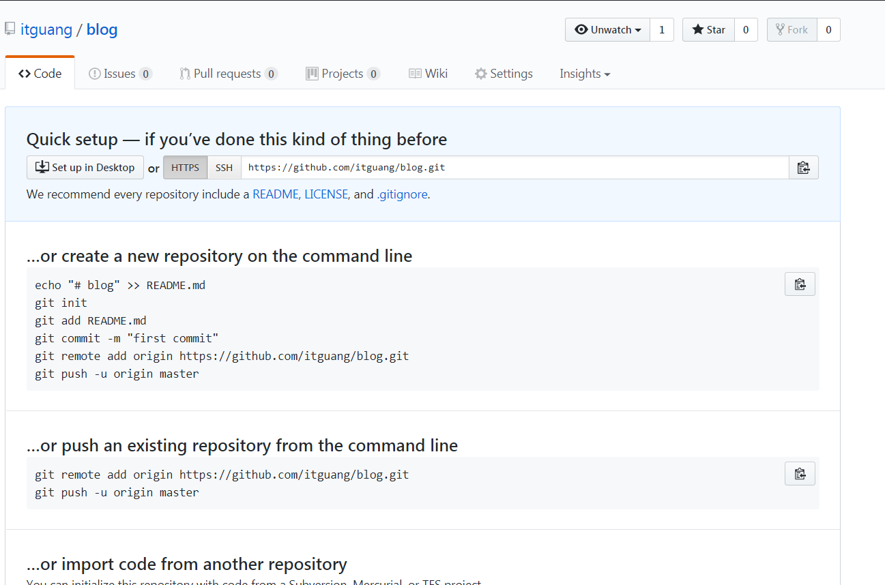

* 第三步:
在创建好的project下新建model---test1
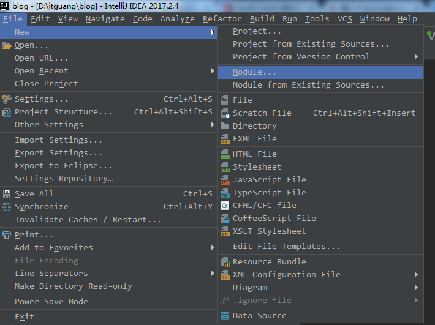

提交刚创建的test1到远程仓库 blog,先add,再commitAndPush

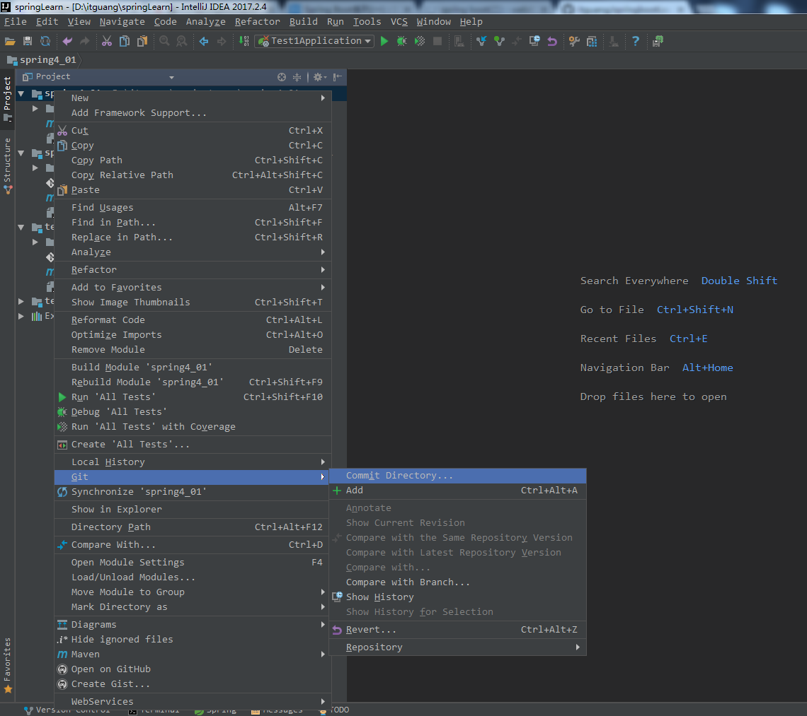

最后在去github仓库看下

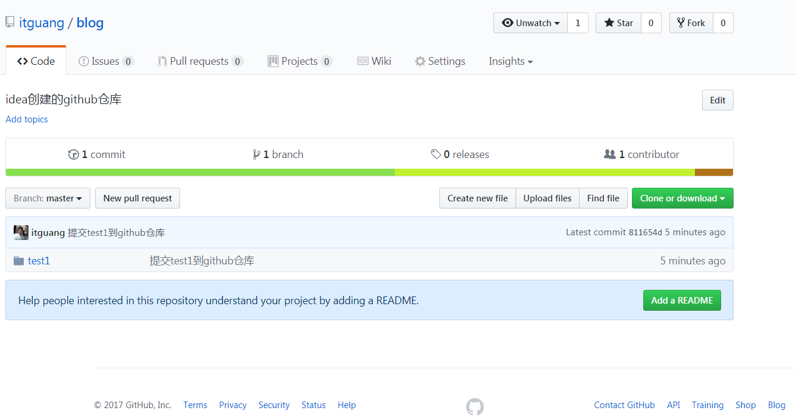

**如果想要再创建一个model可以向刚才创建test1一样,再次创建test2,提交方式参考第三步**

参考文章:

[IntelliJ IDEA 提交代码到 GitHub](http://blog.csdn.net/fatlitalk/article/details/53824844)

