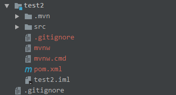
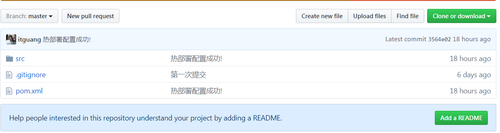
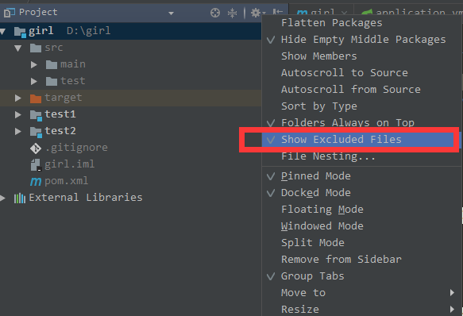

# idea新建maven项目

## 删除不必要文件

新建项目时会出现以下目录结构:

为了简化目录结构,我们把不必要的文件删除就行

比如: .mvn mvnw mvnw.cmd 三个删除.

**这里简单说一下 .gitingore文件**

这是进行版本控制时,提交项目要忽略的文件,可自行配置,一般不需要.

按照默认我们提交项目到github后,目录结构应该是这样的

## 不让idea显示某些文件如:.idea目录,和target目录

有时候我们想让项目看起来更加清晰,即隐藏掉与项目无关文件,可以这样做

把勾去掉即可.

