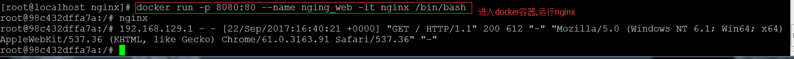

# 1,[Docker安装](http://www.runoob.com/docker/docker-hello-world.html)


# 由于Docker镜像外网访问比较慢,下面可以配置国内镜像


# [Docker - 国内镜像的配置及使用](http://www.cnblogs.com/anliven/p/6218741.html)

我的阿里云Docker镜像仓库 https://cr.console.aliyun.com/#/accelerator


# 容器相关操作

		docker create # 创建一个容器但是不启动它
		docker run # 创建并启动一个容器
		docker stop # 停止容器运行，发送信号SIGTERM
		docker start # 启动一个停止状态的容器
		docker restart # 重启一个容器
		docker rm # 删除一个容器
		docker kill # 发送信号给容器，默认SIGKILL
		docker attach # 连接(进入)到一个正在运行的容器
		docker wait # 阻塞到一个容器，直到容器停止运行
		获取容器相关信息
		docker ps # 显示状态为运行（Up）的容器
		docker ps -a # 显示所有容器,包括运行中（Up）的和退出的(Exited)
		docker inspect # 深入容器内部获取容器所有信息
		docker logs # 查看容器的日志(stdout/stderr)
		docker events # 得到docker服务器的实时的事件
		docker port # 显示容器的端口映射
		docker top # 显示容器的进程信息
		docker diff # 显示容器文件系统的前后变化


## 如何运行docker容器
```bash
 docker run -p 8080:80 --name nging_web -it nginx /bin/bash
```

```bash

[root@localhost nginx]# docker run -p 8080:80 --name nginx_web -it nginx /bin/bash
root@684d3b4f7dd1:/# nginx
root@684d3b4f7dd1:/# 192.168.129.1 - - [22/Sep/2017:16:49:15 +0000] "GET / HTTP/1.1" 304 0 "-" "Mozilla/5.0 (Windows NT 6.1; Win64; x64) AppleWebKit/537.36 (KHTML, like Gecko) Chrome/61.0.3163.91 Safari/537.36" "-"
192.168.129.1 - - [22/Sep/2017:16:49:16 +0000] "GET / HTTP/1.1" 304 0 "-" "Mozilla/5.0 (Windows NT 6.1; Win64; x64) AppleWebKit/537.36 (KHTML, like Gecko) Chrome/61.0.3163.91 Safari/537.36" "-"
192.168.129.1 - - [22/Sep/2017:16:49:17 +0000] "GET / HTTP/1.1" 304 0 "-" "Mozilla/5.0 (Windows NT 6.1; Win64; x64) AppleWebKit/537.36 (KHTML, like Gecko) Chrome/61.0.3163.91 Safari/537.36" "-"
192.168.129.1 - - [22/Sep/2017:16:49:17 +0000] "GET / HTTP/1.1" 304 0 "-" "Mozilla/5.0 (Windows NT 6.1; Win64; x64) AppleWebKit/537.36 (KHTML, like Gecko) Chrome/61.0.3163.91 Safari/537.36" "-"
exit
exit
[root@localhost nginx]# rm nginx_web
rm: 无法删除"nginx_web": 没有那个文件或目录
[root@localhost nginx]# docker rm nginx_web
nginx_web
[root@localhost nginx]# docker run -p 8080:80 --name nginx_web -it nginx /bin/bash
root@39985c796904:/# nginx
root@39985c796904:/# 192.168.129.1 - - [22/Sep/2017:16:50:05 +0000] "GET / HTTP/1.1" 304 0 "-" "Mozilla/5.0 (Windows NT 6.1; Win64; x64) AppleWebKit/537.36 (KHTML, like Gecko) Chrome/61.0.3163.91 Safari/537.36" "-"


```





